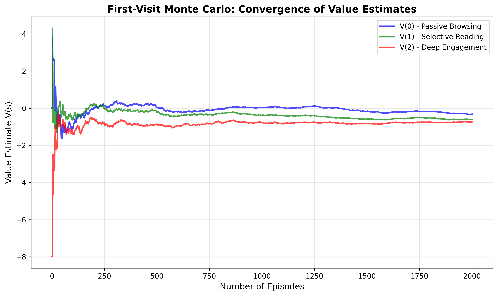
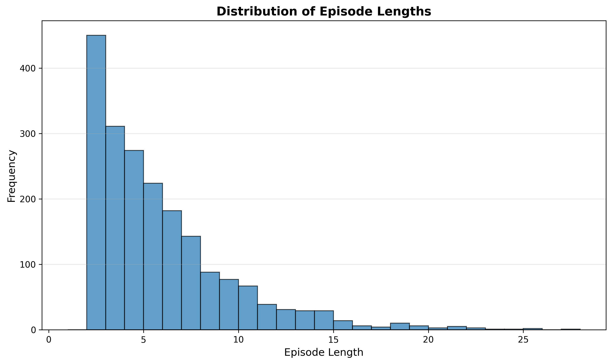

# Monte Carlo Policy Evaluation on User Sessions


## Project Overview

This project implements First-Visit Monte Carlo Policy Evaluation for estimating state-value functions in a user session environment. The environment simulates user engagement states in a news-feed session with delayed and sparse rewards.

## Project Structure

```
rl_project/
├── env.py              # SessionEnv class (environment simulator)
├── mc.py               # First-Visit Monte Carlo implementation
├── utils.py            # Utility functions for plotting and analysis
├── main.py             # Main script to run experiments
├── README.md           # This file
└── report.pdf          # Project report (2-4 pages)
```

## Installation

### Prerequisites
- Python 3.10+ (recommended)
- pip package manager

### Setup

1. Create a virtual environment:
```bash
python -m venv rl_project_env
```

2. Activate the virtual environment:
   - **Windows:**
     ```bash
     rl_project_env\Scripts\activate
     ```
   - **macOS/Linux:**
     ```bash
     source rl_project_env/bin/activate
     ```

3. Install required packages:
```bash
pip install numpy matplotlib
```

## Running the Project

### Basic Execution

Simply run the main script:

```bash
python main.py
```

This will:
1. Initialize the environment
2. Generate 2000 episodes
3. Run First-Visit Monte Carlo evaluation
4. Display results and generate plots

### Output Files

After running, the following files will be generated:
- `convergence_plot.png` - Shows convergence of V(s) estimates over episodes
- `episode_lengths.png` - Distribution of episode lengths
- `terminal_rewards.png` - Distribution of terminal rewards

**Convergence of value estimates:**



**Episode length distribution:**



### Customization

You can modify the number of episodes in `main.py`:
```python
n_episodes = 2000  # Change this value
```

## Environment Details

### States
- **0**: Passive Browsing
- **1**: Selective Reading
- **2**: Deep Engagement
- **3**: Exit (terminal state)

### Rewards
- During session: `reward = 0`
- Terminal reward (when state becomes Exit):
  - `+10` if session length ≥ 8 steps
  - `+4` if session length is 4-7 steps
  - `-8` if session length ≤ 3 steps

### Discount Factor
- `γ = 0.9`

## Algorithm: First-Visit Monte Carlo

The implementation follows the first-visit Monte Carlo method:

1. Initialize V(s) = 0 for all states s ∈ {0, 1, 2}
2. For each episode:
   - Compute returns G_t backwards from terminal reward
   - For each state s_t in the episode:
     - If this is the first occurrence of s_t in the episode:
       - Append G_t to returns[s_t]
       - Update V(s_t) = mean(returns[s_t])

## Key Features

✅ Episodes terminate correctly at Exit state (3)  
✅ Rewards are zero until terminal, then computed from episode length  
✅ Returns computed correctly with discount factor 0.9  
✅ First-visit logic: each state updated at most once per episode  
✅ V(s) averaged over returns (not overwritten)  
✅ Generates 2000+ episodes for strong results  
✅ Plots generated and saved automatically  
✅ Clear printed summary of V(s) values  

## Results

The script outputs:
- Final value estimates V(0), V(1), V(2) in a formatted table
- Convergence plot showing V(s) vs number of episodes
- Episode length and terminal reward distributions
- State analysis showing which states lead to better outcomes

## Monte Carlo vs Dynamic Programming

**Monte Carlo:**
- Learns from actual experience (episodes)
- No model of environment needed
- Can work with only terminal rewards
- Requires many episodes to converge
- Suitable for episodic tasks

**Dynamic Programming:**
- Requires complete model (transition probabilities, rewards)
- Computes exact values through iterative updates
- Converges faster but needs model
- Not suitable when model is unknown

See `report.pdf` for detailed comparison and analysis.

## Troubleshooting

### Import Errors
Make sure all files are in the same directory and the virtual environment is activated.

### Plot Not Showing
Plots are saved as PNG files. Check the current directory for the generated images.

### Different Results Each Run
The code uses a fixed random seed (42) for reproducibility. If you want different results, change the seed in `main.py` and `env.py`.

## Author

RL Project Submission - 9th Jan 2026

## License

This project is for educational purposes.
